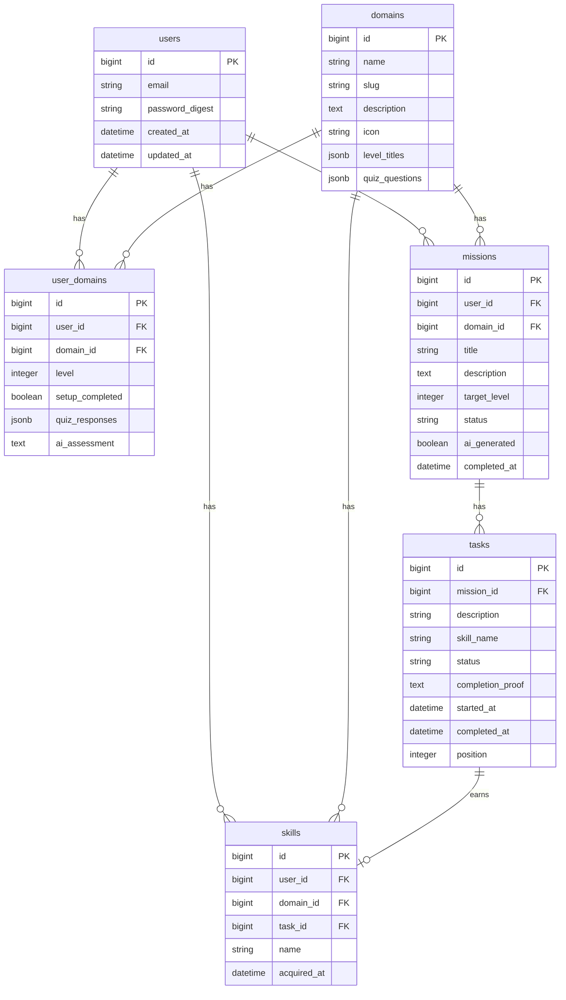

```mermaid
  erDiagram
      users ||--o{ user_domains : has
      users ||--o{ missions : has
      users ||--o{ skills : has

      domains ||--o{ user_domains : has
      domains ||--o{ missions : has
      domains ||--o{ skills : has

      missions ||--o{ tasks : has
      tasks ||--o| skills : earns

      users {
          bigint id PK
          string email
          string password_digest
          datetime created_at
          datetime updated_at
      }

      domains {
          bigint id PK
          string name
          string slug
          text description
          string icon
          jsonb level_titles
          jsonb quiz_questions
      }

      user_domains {
          bigint id PK
          bigint user_id FK
          bigint domain_id FK
          integer level
          boolean setup_completed
          jsonb quiz_responses
          text ai_assessment
      }

      missions {
          bigint id PK
          bigint user_id FK
          bigint domain_id FK
          string title
          text description
          integer target_level
          string status
          boolean ai_generated
          datetime completed_at
      }

      tasks {
          bigint id PK
          bigint mission_id FK
          string description
          string skill_name
          string status
          text completion_proof
          datetime started_at
          datetime completed_at
          integer position
      }

      skills {
          bigint id PK
          bigint user_id FK
          bigint domain_id FK
          bigint task_id FK
          string name
          datetime acquired_at
      }
```